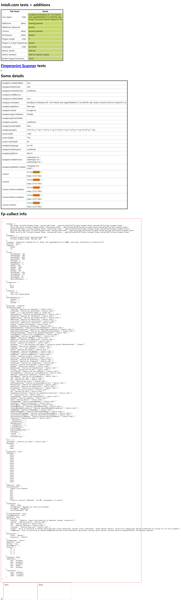
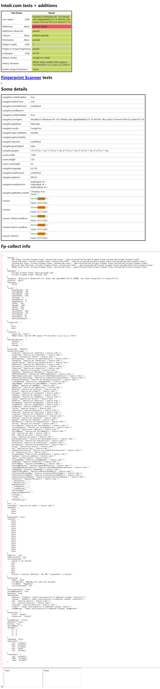

# playwright_stealth

Transplanted from [puppeteer-extra-plugin-stealth](https://github.com/berstend/puppeteer-extra/tree/master/packages/puppeteer-extra-plugin-stealth), **Not perfect**.

## Install

```
$ pip install playwright-stealth
```

## Usage
### sync
```python

from playwright.sync_api import sync_playwright
from playwright_stealth import stealth_sync

with sync_playwright() as p:
    for browser_type in [p.chromium, p.firefox, p.webkit]:
        browser = browser_type.launch()
        page = browser.new_page()
        stealth_sync(page)
        page.goto('http://whatsmyuseragent.org/')
        page.screenshot(path=f'example-{browser_type.name}.png')
        browser.close()

```
### async
```python
# -*- coding: utf-8 -*-
import asyncio
from playwright.async_api import async_playwright
from playwright_stealth import stealth_async

async def main():
    async with async_playwright() as p:
        for browser_type in [p.chromium, p.firefox, p.webkit]:
            browser = await browser_type.launch()
            page = await browser.new_page()
            await stealth_async(page)
            await page.goto('http://whatsmyuseragent.org/')
            await page.screenshot(path=f'example-{browser_type.name}.png')
            await browser.close()

asyncio.get_event_loop().run_until_complete(main())
```

## Test results

### playwright with stealth



### playwright without stealth


